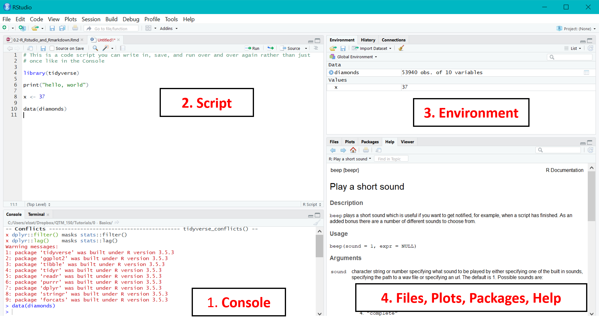

```{r setup, include=FALSE}
pacman::p_load(tidyverse, Lahman)
#knitr::opts_chunk$set(fig.height=4)
```

## R vs. RStudio vs. RMarkdown

**R** is the actual programming language we'll be using. It was developed specifically for data analysis and statistics. Other languages you may be familiar with, like C++ or Java, are more "general purpose" languages that do a broader set of computer-y things but aren't as specialized or easy to work with for data analysis and statistics.

**RStudio** is an interface for using R. It makes programming in R much more pleasant but isn't technically *necessary* to program in R.

**RMarkdown** is probably the most confusing of the three. It's a way of using a language called "Markdown" alongside R code, in the RStudio interface, to create pretty reports, presentations, and other documents that interweave your code, graphics, and explanatory text. 

It's what I used to produce this document you're reading. It's also how you will submit your labs/homework.

  
### R Scripts vs. RMarkdown

You can just write R code with written comments in an R "script" (a file of code that ends `.R`). The pro is this is "lightweight" - it has only code and comments, nothing extraneous. If you're doing straight programming or software development, this is what you'd use.

RMarkdown, as noted above, interweaves code blocks and comments with explanatory text, tables, and graphs. It also lets you format all of the above (for example, bold and italicize text or create bulleted lists). This is great for creating any documents, such as analytical reports, you want to share with colleagues or managers. RMarkdown creates a `.Rmd` file that is then "**knit**" to a format for sharing such as HTML (which will appear like a webpage in any web browser) or PDF.
  
<mark>**Lab Activity 1**</mark>: The easiest way to understand the difference between a **script** and an **RMarkdown document** is to look at two side-by-side, which we'll do now. If you're not in class, you can compare the files `RMarkdown_example.Rmd` and `R_script_example.R` on Canvas.

## Basic R Programming

### RStudio Layout

It will be helpful to start with a map of what happens when you open a .R file (some code) in RStudio. Here's a tour of the basic areas:

```{r, echo = FALSE, out.width = "100%", fig.cap = "*RStudio when you open a code script.*"}

```

1. The **Console**. This is where you can type some code and, as soon as you press "Enter," it runs once. We'll talk more about its uses in a moment.

2. **Scripts**. These are .R files of code that you write and save, just like a Word document. You can run them over and over again. We'll talk more about this in a moment, too.

3. **Environment**. There are several **tabs** here, but the most relevant one is "Environment." This lists **objects** specific to your current R session - we'll cover these in a moment.

4. A miscellaneous window. There are a few important things in this pane:

    i) **Files** - this lists the files and folders in your **working directory** (typically, where the script you're working in is located). I don't use it all that often to be honest.
    ii) **Plots** - when you create a plot by running code in a **script**, this is where it shows up (it will show up in-line in the RMarkdown document if you produce it there).
    iii) **Packages** - this is the list of R **packages** (bits of code that do extra stuff) you have installed on your machine. More on them below.
    iv) **Help** - I end up here all the time. When you need to look up details about how to do something in R, you can type `?[function_name]` in the **Console** and it will pull up information here. For example, try typing `?sum` into your **Console** and see what pops up.
    
Now that you've got the lay of the land, let's talk about how you can run code in R.

### What is R code?

"R code" - or any computer code - is basically text asking your computer to do something. It's a set of instructions. In the same way that I might ask you to stand up, walk over to the bathroom, and wash your hands, I could write some text in a very specific format to tell R "add 1 + 1, then assign that value to a variable called `x`, and store that result somewhere." 

R is **CASE-SENSITIVE**. A very, very common reason your code doesn't run properly is because you accidentally messed up the capitalization of a function name, dataset name, variable, etc. Always be aware of this possibility!

### Some very basic R code examples

#### Arithmetic

Probably the easiest thing to start with in R is to treat it like a big calculator - which you already did in Tutorial 0.1. 

Here's R doing some basic arithmetic that also illustrates the difference between how static code and an interactive exercise look in these tutorials.


```{r arithmetic}
#This is static code and output in RMarkdown.  This green text is a "Comment" that is not run as code.

2+7
```

In RMarkdown, `R code is displayed in a grey box like this`, and R's answer after running that code appears in a box with a white background.

#### Creating Objects

R holds information in things called **objects**. An **object** could be a data frame, or instructions for a function, or a single numerical value, a plot, or a ton of other things.

Here's R creating an object called `x` that it assigns the value 2. The way you "give" an "object" a "value" is to use the **assignment operator** `<-`. Pro tip: use the keyboard shortcut `Alt + minus sign`.


```{r assignment, exercise = TRUE}
x <- 2

x
```

The easiest way to translate the below code into English is "x gets 2" or "x receives 2". Once you've assigned a value to an object, R will remember that and you can use that object for other actions later. For example, what do you think the below code will return? Run it in your own R Console and see if you're right!

```{r object-use, eval = FALSE}
x <- 2

x + 35
```


### R Cheatsheets

Before we move on I want to introduce you to R [Cheatsheets](https://rstudio.com/resources/cheatsheets/). These are incredibly useful summaries of tips and tricks for various common topics in R. The easiest way to access them is going to `Help` > `Cheatsheets`. 

Try opening the one for RMarkdown now!

### Packages

As you've already learned, packages are bits of standalone code, written by others, that when **installed** (and **loaded**) allow R to do different things it couldn't before. 

Most often these add one or more new **functions** (actions that take an input and produce an output) to those R knew before. Sometimes packages also add **objects** such as new datasets or color palettes - for example, the `lahman` package is going to give us the baseball data we'll work with below.

To use a package you have to **install** it once and **load** it every time you open a new R session. A good analogy for all this is a lightbulb. To get light you have to do two things: screw in the bulb, and flip a switch on. Installing a package is like screwing in the bulb - you only have to do it once, and it's there for you in the future. Loading it is like flipping the lightswitch - you have to do this every time you want the light.

The easiest way to do all this is with the `pacman` package, which automates a lot of the work. 

<mark>**Lab Activity 2**</mark>: Open an R script, save it as `SiS_Lab_1`, and add this code to it, and run by placing your cursor in the line and hitting `Ctrl/Cmd + Enter` to install and load the `Lahman` package:

```{r pkgs}
#This code loads the Lahman and tidyverse package, but installs either one first IF AND ONLY IF you don't already have it installed

pacman::p_load(Lahman, tidyverse)
```
Now we're all ready to use the `Lahman` package.

Sidenote: why did we use the `::` above? To access the `p_load()` function from the `pacman` package without bothering to load `pacman` separately, we needed to use this syntax. 

## Baseball Data!

OK, time for the fun stuff. I hope, anyway.

### Exploring New Datasets

There are a number of ways to get data into R, but the process can be a bit tedious so we're going to skip that for now. Instead we're going to make use of datasets - called **data frames** in R-speak - that we've already loaded into R via the `Lahman` package.

To see a list of the available datasets, run the code `?Lahman` in your **Console** to view the package help page. 

We're going to be working with the `Teams` data frame. First we should load it so we can see it in Environment pane:

<mark>**Lab Activity 3**</mark>: Add all code below to your script as we go.

```{r load_data}
# Show Teams data in environment pane
data(Teams)

data(Batting)
```

Then to explore a data frame I usually first try clicking on it in my environment pane (or, alternatively but less desirably in my opinion, typing `View(Teams)` in my Console). If you've ever looked at an Excel spreadsheet this should feel familiar, which is why I find it a good place to start - at least before you get more R experience.

Then I usually like to use the following functions from the `tidyverse` package:

```{r explore_data}
# Print first 6 rows of data
head(Teams)
head(Batting)

# Show "structure" of data - including dimensions (rows and columns), variables, and variable types
str(Teams)

# Provide a summary of each variable in the data frame
summary(Teams)
```
Finally, since this data is part of a package in R, run `?Teams` to get to the help page for the data frame while looking at everything else. This provides a sort of **Data Dictionary** to help you decode what you're seeing. (Note if the data you're using isn't part of a package you may need some other external data dictionary to explain what you're seeing.)

<mark>**Lab Activity 4**</mark>: Use what we did above to answer the following questions about the data frame:

1. How many rows are there?

2. How many columns are there?

3. What do you think each row represents? 

4. What does the `H` column in row 2,182 represent, in words?

### Rectangular Data

Much of the data you'll work with in sports - though by no means all! - is **rectangular data**. This is all we'll be working with in this course.

Rectangular data is like an Excel spreadsheet. It's organized into rows and columns. Each row can be considered an **observation** with values for a bunch of different **variables**. These variables are the columns.

For example, in `Teams` each row is a "team-season" (one team in one season), with a bunch of different performance data for those team-seasons in the columns.

### Basic Data Manipulation

There are 5 basic tasks I want to show you how to do in R. But first I have to introduce you to a new concept that will make all this easier: the pipe, written `%>%` but most easily entered using the shortcut `Ctrl/Cmd + Shift + M`.

#### The Pipe

The pipe lets us "chain" multiple functions together. The easiest way to understand it for now is to read it as `Take This Thing/Result Before the Pipe, Then (%>%) Do This Thing After The Pipe To It`. The pipe is the "then" in that sentence. Examples follow below.

#### Choosing Rows That Fit Criteria Using `filter()`

Say we want to get a data frame of teams from *just* the 2019 MLB season. We can do it using the `filter()` function:

```{r filter}
# Create a new data frame with just the 2019 MLB season
teams_2019 <- Teams %>% # Take the Teams data frame, THEN
  filter(yearID == 2019) # Filter to only rows where the yearID variable, which indicates season, equals 2019

```

Note to check if some value or variable equals some other value or variable we have to use `==`, not `=`! You *will* screw this up more than once. It's OK.

<mark>**Lab Activity 5**</mark>: Now inspect the new data frame, and print its first 6 rows using `head()`.

1. What do you see at the top? Is it different from before? How many rows does the new data frame have, and are you surprised by that?

2. Can you describe what the code `teams_2019 <- teams %>% filter(yearID == 2019, lgID == "NL")` would produce? If you can't intuit it, try running it yourself.

##### **Other Comparison Operations**

You can use `==` to check if two things are equal.

You can use `!=` to check if two things are *un*equal.

You can use `>`, `<`, `>=`, and `<=` as you might expect.

#### Choosing Columns Using `select()`

Our data frame right now has 48 variables. That's a lot. What if we want to work with only a manageable subset?

```{r select}
# Print (but not create) a new data frame with just a few variables
teams_2019 %>% # Take the teams_2019 data frame from above, THEN
  select(yearID, teamID, W, L, R, AB, H) %>%  # Select only columns for year, team, wins, losses, runs, at-bats, and hits, THEN
  head() # Print the first 6 rows of the result


# A shorter way to code the same selection
teams_2019 %>% 
  select(yearID, teamID, W, L, R:HR) %>%  # `R:H` selects all columns between R and H, inclusive
  head() 
```

<mark>**Lab Activity 6**</mark>: Add the number of doubles, triples, and HRs to *both* the code bits above.

#### Sorting Data With `arrange()`

If you want to look for the top teams in a season or record breaking performances, you probably need to sort your data. For example, if we want to know which team(s) hit the fewest triples in 2019 we could do something like:

```{r sort}
# Print (but not create) a new data frame with just a few variables
teams_2019 %>% # Take the teams_2019 data frame from above, THEN
  select(yearID, teamID, W:L, R:HR) %>%  # Select a few columns, THEN
  arrange(X3B) # Sort the data frame by number of triples
  
```

Note above we used the pipe to chain MULTIPLE data transformation functions. We took some data, THEN selected some columns, THEN sorted the data. There's no limit here! I've chained probably 20 together in a data processing step before.

<mark>**Lab Activity 7**</mark>: 

1. Can you guess what the below code does *without* running it? Then run it and see if you're right. Note only the `arrange()` line is different.

```{r sort2, eval = FALSE}

teams_2019 %>% 
  select(yearID, teamID, W:L, R:HR) %>% 
  arrange(desc(X3B)) # arrange(-X3B) would accomplish the same thing and is less typing
  
```

2. *Use code* to figure out which team had the most strikeouts in 2019 and how many they had.

3. Does anyone have another record they'd like to look up using `arrange()`?

#### Creating New Variables With `mutate()`

Sometimes the variables we want don't already exist in a data frame. What if we want the total number of extra base hits (doubles, triples, and HRs) a team hit, for example? Easy!

```{r mutate}

teams_2019 %>% # Take the 2019 team data, THEN
  select(yearID, teamID, R:HR) %>% # Choose just a subset of columns, THEN
  mutate(extra_base_hits = X2B + X3B + HR) # Create a new variable that sums doubles, triples, and HRs
  
```

You can do much more than sum things in `mutate()`. You can create new variables to define if one variable is bigger than another or some set amount:

```{r mutate2}

teams_2019 %>% # Take the 2019 team data, THEN
  select(yearID, teamID, R:HR) %>% # Choose just a subset of columns, THEN
  mutate(big_power = HR > 200) # Create a new variable about whether the team hit more than 200 HRs
  
```

Notice this is a new type of variable we haven't seen before - `TRUE` or `FALSE`. R calls this a **logical** variable. It is treated as `TRUE` and `FALSE` but also as `1` and `0`, respectively, "behind the scenes." This may become relevant later.

You can also create a new variable based on certain conditions:

```{r mutate3}

teams_2019 %>% # Take the 2019 team data, THEN
  select(yearID, teamID, R:HR) %>% # Choose just a subset of columns, THEN
  
  # Create a new variable that is...
  mutate(power = case_when(HR < 200 ~ "Learn to Bunt", # "Learn to bunt" if they hit under 200 HRs, or
                           HR < 275 ~ "Meh",           # "Meh" if they hit from 200-274 HRs, or
                           TRUE ~ "Mashin' Taters!"))  # "Mashin' Taters!" if they hit 275+ HRs
  
```

The way `case_when()` works is it first checks to see if the first condition you set resolves to `TRUE` for a given row/observation. *If it does*, it assigns the first indicated value. *If it doesn't*, it goes on to the second condition. 

If *that second condition* resolves to `TRUE`, it assigns the second value. And so on.

If it gets to the last condition, any rows remaining get that value because all will resolve to `TRUE`.

Note that if a row meets the first condition, it does NOT get evaluated for future conditions; its day is done and it hits the showers.

##### **Variable Naming**

Variable (and data frame, and function) names should be **brief** and **descriptive**. They should also never have spaces in them. Instead either use_underscores_to_separate_words (this is called **snake_case**) or capitalizeAllButTheFirstWord (this is called **camelCase**). Use whatever you want, but please know camelCase is the devil's programming.

Above I opted for a little longer name in the interest of being more descriptive, but something like `XBH` would improve brevity, especially if I'm working with other baseball folks who will instantly know what "XBH" means. This is an art - just keep brief and descriptive as your guiding principles.

<mark>**Lab Activity 8**</mark>: Create another new variable for all 2019 teams' "run differential" (the number of runs they scored versus the runs scored against them by their opponents (`RA` in this data frame)).

#### Calculating Grouped Summaries With `group_by()` and `summarize()`

This is the most complicated piece of data transformation we're going to learn. It's a little tough for your first day, but it's also foundational.

What if I want to know the total number of HRs hit by all teams in a season from 1960-2019? Our problem is our data frame is organized by *team-season*, not just season. To fix that I could use code like this:

```{r group_sum}

Teams %>% # Take the teams data, THEN
  filter(yearID %in% c(1960:2019)) %>%  # Get only the years 1960-2019, THEN
                                        # (We could've used >= and <=, but this is more compact. Can you interpret this code?)

  group_by(yearID) %>% # For every year...
  
  # Create a new variable that is the sum of HRs for each group indicated above, in this case each year
  summarize(HRs = sum(HR)) 
  
```

<mark>**Lab Activity 9**</mark>: 

1. What if we wanted to count the total number of *games won* by each *team* in the *1990s*? How would we modify the above code to accomplish that?

2. Does anyone have another grouped summary they're interested in calculating?

Note you can also group by multiple variables. For example, if I wanted to get the number of HRs hit each year from 1960-2019 *for each League* (AL and NL) I could do:

```{r group_sum2}

Teams %>% # Take the teams data, THEN
  filter(yearID %in% c(1960:2019)) %>%  # Get only the years 1960-2019, THEN
                                        # (We could've used >= and <=, but this is more compact. Can you interpret this code?)

  group_by(yearID, lgID) %>% # For every year AND LEAGUE...
  
  # Create a new variable that is the sum of HRs for each group indicated above, in this case year AND league
  summarize(HRs = sum(HR)) 
                           
  
```

### Basic Data Visualizations

While R has basic plotting capabilities, the way you do data visualization in the `tidyverse` (the "environment" we've been working in as opposed to base R because it's easier to learn) is with the `ggplot()` function from the `ggplot2` package.

Covering the details of *why* `ggplot()` code is written the way it is is too in-depth for this course and tutorial. But I want to give you some code for some basic chart types that you can hopefully copy and tweak on your own. 

(If you want to learn much more about plotting in R, I encourage you to download and work through my Tutorials for my QTM 150 by running the following code:

`pacman::p_load(devtools, learnr)`

`install_github("zbinney/QTM150")`

`learnr::run_tutorial("1.1", package = "TutorialsQTM150151")`

Start with the Data Visualization part of Tutorial 1.1. Then continue with Tutorials 1.2 and 1.3.)

#### Single Continuous Variable

A single continuous variable could be visualized using a **histogram** or a **density plot**. Here's code for both:

```{r histogram}

teams_2019 %>% # Take the 29 team data 
  ggplot(aes(x = R)) + # Feed it to ggplot, and set the X "aesthetic" to be runs (that is, make the x-axis be runs)
                       # Notice this line ends with a `+`, not a `%>%`. This is because we are "adding" layers to the plot
  
  geom_histogram(binwidth = 50,   # A "geom" is a "layer" you add to the plot. 
                 color = "blue") + # It's roughly equivalent to the graph type you want to make.
                                  # For a histogram you can manually specify the width of the bins you want as we did here, 
                                  # or the number of bins with e.g. bins = 10.
                                  # You can also set the color with `fill=`.
                                  # You may have more than one layer (e.g. put down scatterplot points, then overlay a line).
                 
  
  labs(x = "Runs", # Change the x-axis label
       y = "Number of Teams", # Change y-axis label
       title = "Distribution of Runs Scored by MLB Teams in 2019") # Add an overall BRIEF but DESCRIPTIVE title to the chart
                                                                   
  
  
```

```{r density}

teams_2019 %>% 
  ggplot(aes(x = R)) + 
  
  geom_density(color = "blue") + # Here because we wanted a different graph type we simply changed the geom
                                 # Note `color` and `fill` are different. 
                                 # `color` deals with lines and outlines.
                                 # `fill` deals with filling shapes.
                                 # Try adding a `fill` to this density plot. Then try changing the `fill` to `color` in
                                 # the histogram above.
                 
  
  labs(x = "Runs",
       y = "Density", # No longer shows number of teams, just "density"
       title = "Distribution of Runs Scored by MLB Teams in 2019") 
  
  
```

<mark>**Lab Activity 10**</mark>: 

1. How would you describe the distribution of runs scored by team in 2019?

2. What are the strengths and weaknesses of the histogram and density plot above? What does one show that the other doesn't? Which do you prefer?

3. Alter either plot above to show the distribution of doubles rather than runs.

4. Note `color` and `fill` are different. `color` deals with lines and outlines. `fill` deals with filling shapes. Try adding a `fill` to the density plot. Then try changing the `fill` to `color` in the histogram.

5. Is there any other variable you'd like to see the distribution of?

Just like with other code, you can always save these results to a plot object using `<-`. To print the plot you then simply type the object name, just like to print a data frame or another object's value.

#### Two Continuous Variables

The "standard" graph type for two continuous variables is a scatterplot. It's hardly the only option but usually a good first try! For other options, I recommend reviewing [this website](https://www.r-graph-gallery.com/).

Let's do a simple scatterplot of wins vs. run differential (the number of runs the team scored minus the number of runs scored on them by their opponents).

```{r scatter}

Teams %>% # Take Teams data
  filter(yearID >= 2001, yearID <= 2019) %>% # Only use team data from 2001-2019
  
  mutate(rundiff = R - RA) %>% # Create a new variable for run differential
  
  ggplot(aes(x = rundiff, y = W)) + # Set the x "aesthetic" to be wins (that is, plot wins on the x-axis) 
                                    # Set the y "aesthetic" to be rundiff (that is, plot rundiff on the y-axis)
  
  geom_point() + # Make our first layer a scatterplot using geom_point
  
  geom_smooth() + # Add a second layer of a smoothed line of best fit on top of the scatterplot
  
  labs(title = "Run Differential vs. Wins in MLB, 2001-19", # Add brief, descriptive title
       x = "Run Differential", y = "Wins") # Make better x and y axis labels
```

<mark>**Lab Activity 11**</mark>: 

1. Is there an association between run differential and wins from 2001-2019 in MLB? If so, how would you describe it?

2. Is there any other pair of variables you'd like to plot the association between?

#### One Continuous and One Categorical Variable

Here again we have a lot of choices, but one I like is boxplots *plus the raw data* (if your sample size isn't too huge). For other options, I recommend reviewing [this website](https://www.r-graph-gallery.com/).

Anyway, here's some code to look at the distribution of stolen bases by League (AL vs. NL) in 2019:

```{r box_and_jitter}

teams_2019 %>% # Take 2019 data
  
  ggplot(aes(x = lgID, y = SB)) + # Set the x "aesthetic" to League (you'll see why we put lgID on the "x-axis" when you run it)
                                  # Set the y "aesthetic" to steals (that is, plot SB on the y-axis)
  
  geom_boxplot() + # Add a boxplot layer first
  
  geom_jitter(height = 0) + # Then add a second layer: a "jittered" scatterplot using geom_jitter
                            # Jittering adds a small amount of random noise to each point.
                            # To see why, try replacing this line with `geom_point()` instead.
                            # `height = 0` means no *vertical* jitter.
  
  
  labs(title = "Steals by League in MLB, 2019", # Add brief, descriptive title
       x = "League", y = "Steals") # Make better x and y axis labels
```

Another great option is returning to density plots, but this time splitting them:

```{r density2}

teams_2019 %>% # Take 2019 data
  
  ggplot(aes(x = SB,           # Set the x "aesthetic" to steals, just like we did with runs in the density plot above
             fill = lgID)) +   # Instead of a y "aesthetic", we tell R to "fill" by League.
                               # ggplot understands this to mean you want the plot SPLIT AND filled by League.
                                 
  
  geom_density(alpha = 0.3) + # Create a density plot. 
                              # `alpha=` controls the transparency of the curves; runs from 0-1, lower is more transparent.
                              # To see why we used it, try deleting it.
  
  labs(title = "Team Steals by League in MLB, 2019", # Add brief, descriptive title
       x = "Steals", y = "Density")                  # Make better x and y axis labels
```

```{r}


```


<mark>**Lab Activity 12**</mark>: 

1. Do you see any difference in the distribution of steals between AL and NL teams? Justify your thinking.

2. Is there any other pair of variables you'd like to investigate with charts like these?

## Conclusion and Credit

Now you're well equipped to encounter data in R, explore it, do some basic manipulations to find interesting stats, and create a few basic plots. You can actually do quite a lot after just this one lab. Be proud!

Parts of this lab and HW were adapted from Mike Lopez's Statistics in Sports course [here](https://github.com/statsbylopez/StatsSports20).

## Lab HW 1

Here are the questions for your first HW. You should answer these in an RMarkdown document, knit to **PDF** and submit on Canvas. This HW is worth 10 points total.

<mark>**HW Q1**</mark>: Create an RMarkdown file for HW1. Make sure you assign a proper name and title, but also change the date to November 19, 2019 (just so I know you figured out how to change it). (0.5 pts)

<mark>**HW Q2**</mark>: Create a heading, insert a code chunk to make R assign some numeric or alphabetic value to an object of your choice, then explain what that code did in text above and/or below the chunk. (1 pt)

<mark>**HW Q3**</mark>: Create another broad heading for this and all following questions. Take a moment to think of a good one. Headings really help readers understand and navigate your documents. (0.5 pts)

<mark>**HW Q4**</mark>: Now create a sub-heading (that is, a heading of a smaller style than whatever you used above in Q3) specifically for this question. It should be brief but descriptive, and should *not* be "Q4" or something similar. Nobody will know what that means besides me. (2 pts)

Now use `head()` and `str()` in a code chunk to explore the `Batting` data frame. (You should also use help pages + `View()` on your own, but don't include those in your RMarkdown document as they won't render well.) 

Note that instead of player names there are `playerID`s. You can simply refer to players using their IDs, but if you can guess their names feel free to use those, too.

Once you've become familiar with the table explain your findings, including:

A. How many rows are there?

B. How many columns are there?

C. What do you think each row represents? 

D. What does the `SO` column's value in the last row represent, in words?

<mark>**HW Q5**</mark>: Create another sub-heading for this question. Then create a new data frame with only `playerID`, team, and number of home runs, and print the rows with the 6 highest home run values. Explain your findings in 1-2 sentences. (2 pts)

<mark>**HW Q6**</mark>: Create another sub-heading for this question. Which player holds the record for most triples *per game* in a season in the 2010s? You can just print your result here, no explanation required if you have a sufficiently descriptive heading. (2 pts)

<mark>**HW Q7**</mark>: Create another sub-heading for this question.

Create any visualization you want using the `Batting` data frame. Most likely you'll want to just modify some of the code we used above to keep things simple, but the question you investigate is up to you. Do something that interests you! Explain/interpret your visualization in 1-2 sentences. If it provides any insights into the sport (it doesn't have to), explain them. (2 pts)
